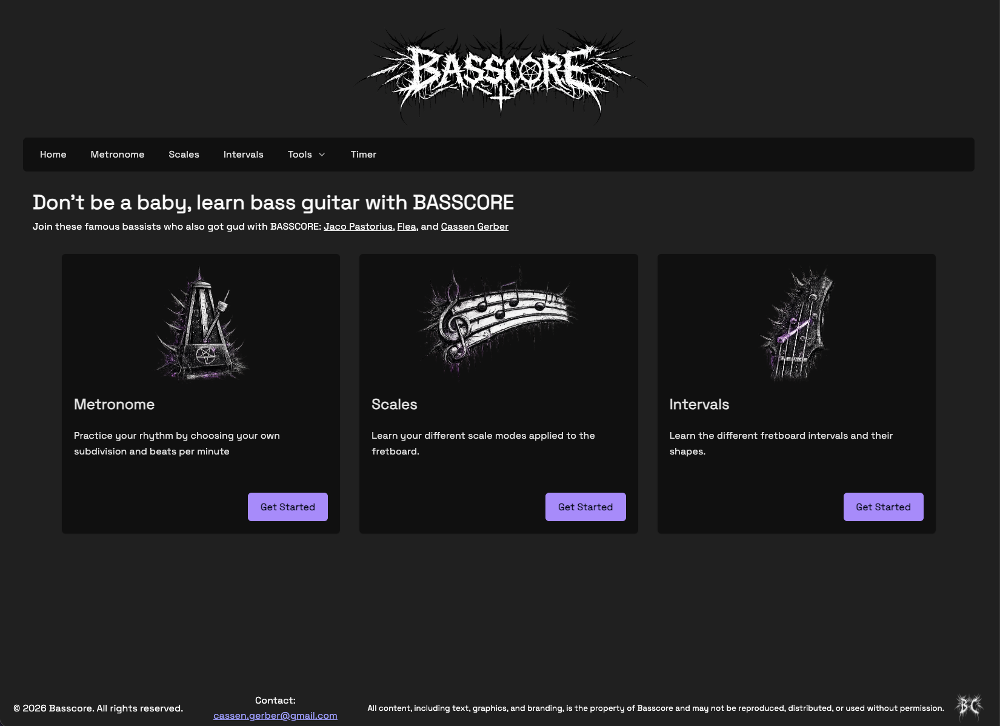
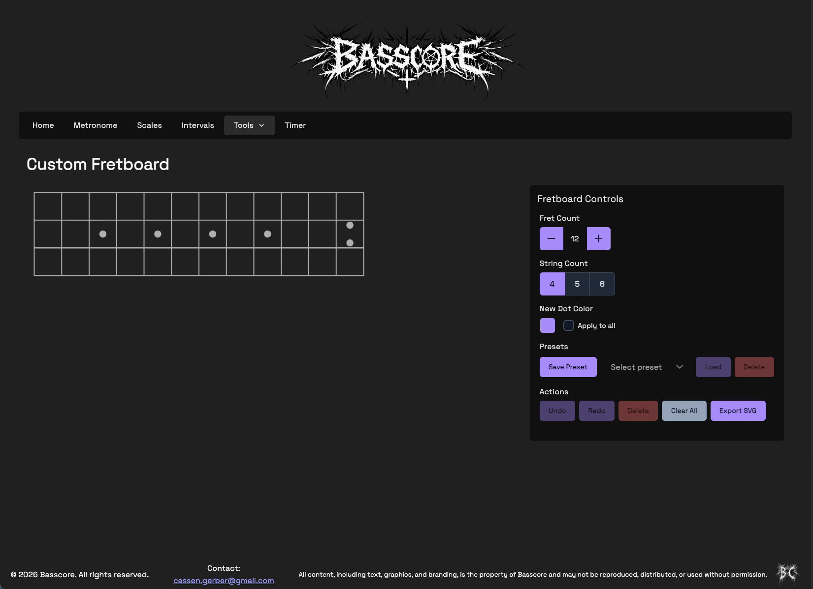
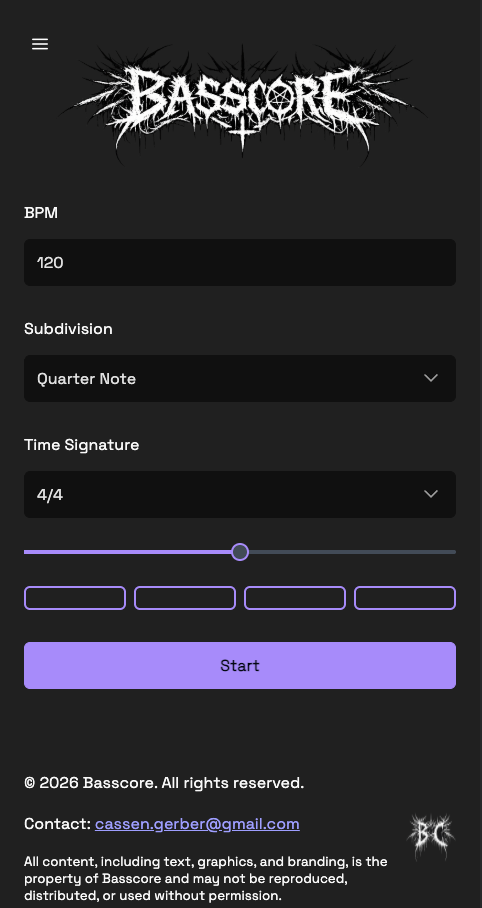

# BASSCORE

[](LICENSE)
[](https://cassen999.github.io/basscore/home)
[](https://react.dev)
[](https://www.typescriptlang.org)

A web-based practice tool and reference hub for bass guitar. Map scales and intervals on an interactive fretboard, keep time with a metronome, build custom fretboard diagrams, and more — all in the browser, no install required. Fully responsive with a dedicated mobile experience for every page.

**[Live Demo →](https://cassen999.github.io/basscore/home)**

---

## Screenshots

<p>
  
  &nbsp;
  
</p>
<p align="center">
  
  <br/>
  <sub>Metronome — mobile view</sub>
</p>

---

## Features

BASSCORE is fully responsive with a dedicated mobile experience for every page — optimized layouts, touch interactions, and mobile-specific controls throughout. All interactive elements are keyboard accessible and built to meet **WCAG 2.0 AA** accessibility standards.

### Scales
Explore scales visually on an interactive bass fretboard. Select a root note, scale type, and position to see exactly where the notes fall on the neck.

### Intervals
Learn interval relationships on the same interactive fretboard layout. A solid tool for building fretboard fluency and laying the groundwork for ear training.

### Metronome
A clean, accurate metronome with BPM control and subdivision support, paired with a real-time beat visualizer so you can see the pulse as well as hear it.

### Custom Fretboard
A fully interactive fretboard canvas for building your own diagrams. Place dots with custom colors and labels, undo and redo freely, save and load presets, and export your diagrams as SVG files.

---

## Tech Stack

- **React 19** + **React Router 7**
- **TypeScript 5**
- **Vite 7**
- **PrimeReact 10** (UI components)
- **SCSS** with CSS custom properties and BEM methodology
- **Vitest 4** + **React Testing Library** (testing)

---

## Getting Started

### Prerequisites

- Node.js 18 or higher
- npm

### Installation

```bash
git clone https://github.com/Cassen999/basscore.git
cd basscore
npm install
```

### Running Locally

```bash
npm start
```

The dev server runs at `http://localhost:5173`.

---

## Contributing

BASSCORE is licensed under the PolyForm Noncommercial License 1.0.0 — feel free to fork it, learn from it, and share it for any noncommercial purpose. If you'd like to contribute directly to the project, fork the repo and follow the pull request guidelines below.

### File Structure

Components live in `src/components/<ComponentName>/` alongside their SCSS and test files. Shared types belong in `src/types/types.ts`. Hooks go in `src/hooks/`. Global styles live in `src/styles/`.

For the full breakdown of naming conventions, component registry, and the checklist for adding new files, see [CLAUDE.md](CLAUDE.md) and [_dev/ARCHITECTURE.md](_dev/ARCHITECTURE.md).

### Testing

Tests are colocated with the components they cover and use **Vitest** + **React Testing Library**. The project maintains a minimum of **90% code coverage**. Run the test suite before committing:

```bash
npm run test:run       # single run
npm run test:coverage  # run with coverage report
```

Do not submit a PR if tests are failing or coverage has dropped below threshold.

### Accessibility

All contributions should uphold **WCAG 2.0 AA** standards. This means proper semantic markup, sufficient color contrast, keyboard navigability, and touch targets that meet minimum size requirements on mobile.

### Branching Strategy

This project uses a `main → develop → feature` model.

| Branch | Purpose |
|---|---|
| `main` | Stable/release only — no direct commits |
| `develop` | Integration branch — no direct commits |
| Feature branches | All work happens here, always branched off `develop` |

**Branch naming:**

```
<GitHub-Username>/<feature-name>
bug-fix/<bug-description>
```

Examples: `cassen999/my-new-feature`, `bug-fix/metronome-crash`

Bug fix branches use a short description (a word or two is fine). Describe the actual bug in the PR body.

### Pull Requests

- All PRs target `develop` — **no PRs into `main`**
- Request a review from [@Cassen999](https://github.com/Cassen999) before merging
- Follow the testing strategy outlined in [_dev/plans/testing/TESTING_STRATEGY.md](_dev/plans/testing/TESTING_STRATEGY.md) before submitting

---

## Roadmap

BASSCORE is actively in development. Here's what's coming:

- **Data Layer & Backend** — A database to power persistent storage across the app
- **User Profiles** — Log in and save global settings, fretboard presets, and more
- **Notes Canvas** — A free-form canvas for writing notes and pasting exported fretboard diagrams *(dependent on data layer and user profiles)*
- **Audio Input / Game of BASS** — Connect your instrument directly to the app. The first feature built on this will be a musical take on Horse/Skate: one player taps out a short sequence of notes, the second has to mimic it — miss a note, earn a letter of B-A-S-S
- **Flashcards** — A practice mode for drilling scales, intervals, and anything else worth committing to memory
- **Enhanced Metronome** — Custom beat sounds, a visual subdivision builder, per-subdivision sound assignment, and short looping patterns to play along with
- More to come

---

## Contact

Have a question, found a bug, or just want to say hi? Feel free to reach out.

**Email:** cassen.gerber@gmail.com

---

## License

PolyForm Noncommercial License 1.0.0 — free to use, modify, and share for any noncommercial purpose. Commercial use is reserved. See [LICENSE](LICENSE) for details.
