# Custom Fretboard — Technical Diagram

Lives under **Teaching Tools** in the nav at `/teaching-tools/fretboard`.

---

## New File Map

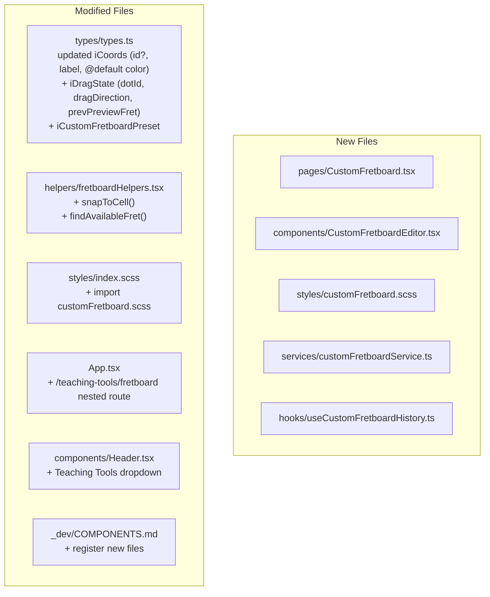

---

## Teaching Tools Nav Structure

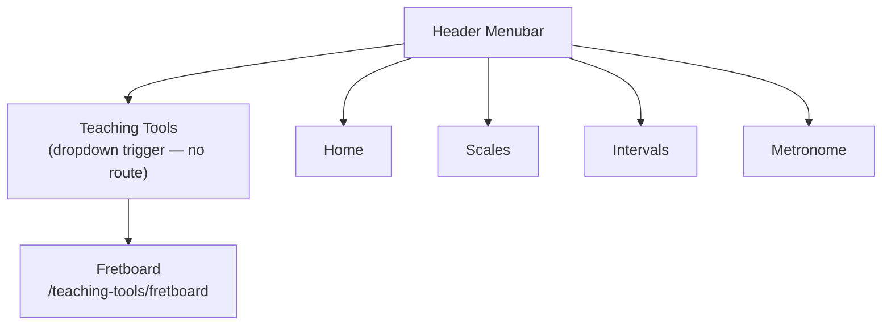

---

## Component Hierarchy

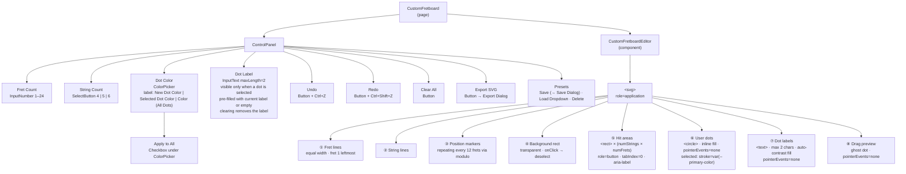

---

## Data Flow

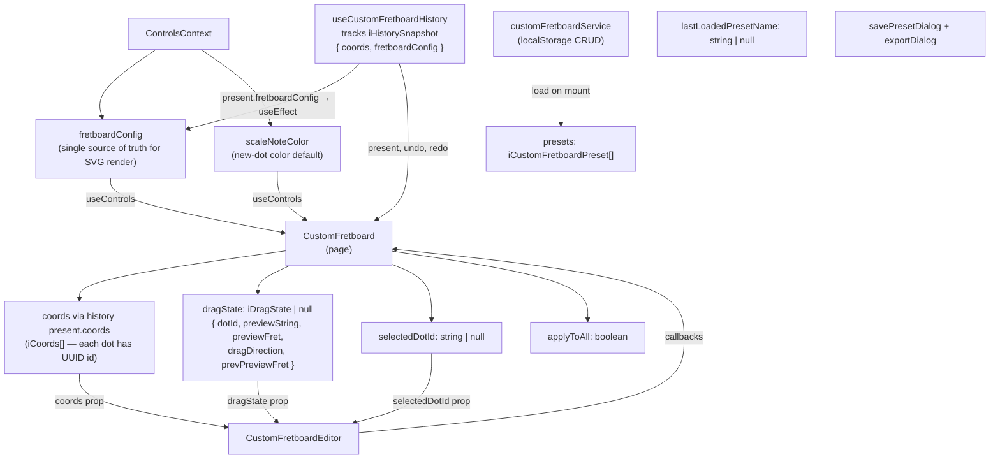

---

## Dot Color Picker Behavior

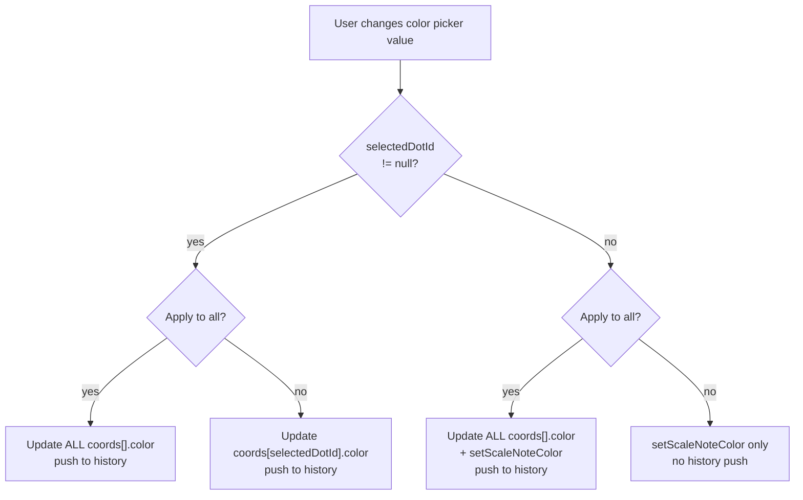

ColorPicker label text:
- No dot selected + Apply to all off → **"New Dot Color"**
- No dot selected + Apply to all on → **"Color (All Dots)"**
- Dot selected + Apply to all off → **"Selected Dot Color"**
- Dot selected + Apply to all on → **"Color (All Dots)"**

---

## Dot Selection and Deselection

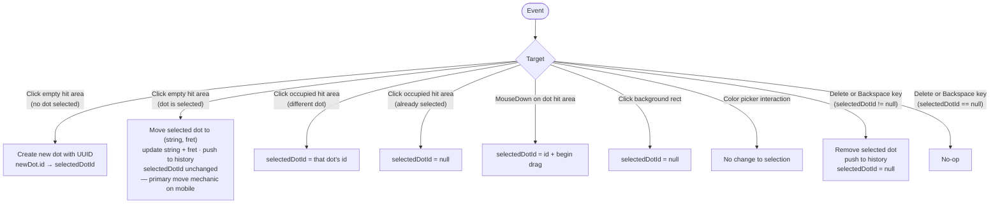

---

## Interaction Model

```mermaid
flowchart TD
    A([User Action])
    A --> B{Action type}

    B -->|"Click empty hit area\n(no dot selected)"| ADD["Create dot { id: UUID, str, fret, color }\nselectedDotId = new id · push to history"]
    B -->|"Click empty hit area\n(dot selected)"| MOVE["Move selected dot to (str, fret)\nupdate string + fret · push to history\nselectedDotId unchanged"]
    B -->|Click unselected dot| SEL["selectedDotId = dot.id"]
    B -->|Click selected dot| DESEL["selectedDotId = null"]
    B -->|Click background| DESEL2["selectedDotId = null"]
    B -->|Delete/Backspace (dot selected)| DEL["Remove dot · selectedDotId = null · push to history"]
    B -->|Change color picker| CC["handleColorChange() — see Color Picker Behavior"]
    B -->|Toggle Apply to All| ATA["applyToAll = !applyToAll"]
    B -->|"Type in Label InputText\n(dot selected)"| LBL["handleDotLabelChange(selectedDotId, value)\ntrim to 2 chars · empty = undefined\npush to history"]
    B -->|MouseDown on dot hit area| MDD["selectedDotId = id\ndragState = { dotId, previewStr, previewFret,\ndragDirection: 1, prevPreviewFret: dot.fret }"]
    B -->|MouseMove on SVG| MM{"dragState\n!= null?"}
    B -->|MouseUp on SVG| MU{"dragState\n!= null?"}
    B -->|Ctrl+Z| UND["history.undo() · setFretboardConfig(restored)"]
    B -->|Ctrl+Shift+Z| RED["history.redo() · setFretboardConfig(restored)"]
    B -->|Change Fret/String Count| CFG["trimCoords() · setHistory(trimmed, newConfig)"]
    B -->|Click Clear All| CLR["setHistory({ coords: [], fretboardConfig })\nselectedDotId = null"]
    B -->|Click Save Preset| SAVEBTN["Open Save Preset Dialog\npre-fill name = lastLoadedPresetName ?? ''"]
    B -->|Confirm Save Preset| SAVE["getByName(name)?\nupdateById OR save()\nreload presets · close dialog"]
    B -->|Load Preset| LP["setHistory(preset)\nsetFretboardConfig(preset.config)\nselectedDotId = null\nlastLoadedPresetName = preset.name"]
    B -->|Delete Preset| DP["deleteById · reload presets"]
    B -->|Click Export SVG| EXBTN["Open Export Dialog\nfileName = lastLoadedPresetName ?? 'fretboard'"]
    B -->|Confirm Export| EX["exportSvg(fileName)"]

    MM -->|yes| DRAG["See Drag with Collision diagram"]
    MM -->|no| NOP([noop])
    MU -->|yes| COMMIT["coords[dotId] updated to previewStr/previewFret\ndragState = null · push to history"]
    MU -->|no| NOP2([noop])
```

---

## Drag with Collision Detection

`prevPreviewFret` is stored in `dragState` and updated on every `onMouseMove` after computing the new preview position.

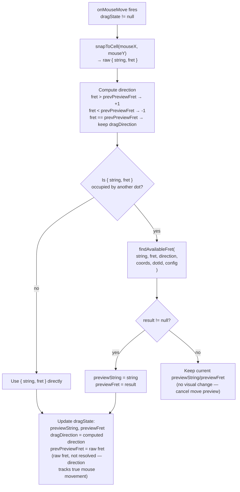

---

## `findAvailableFret` Logic

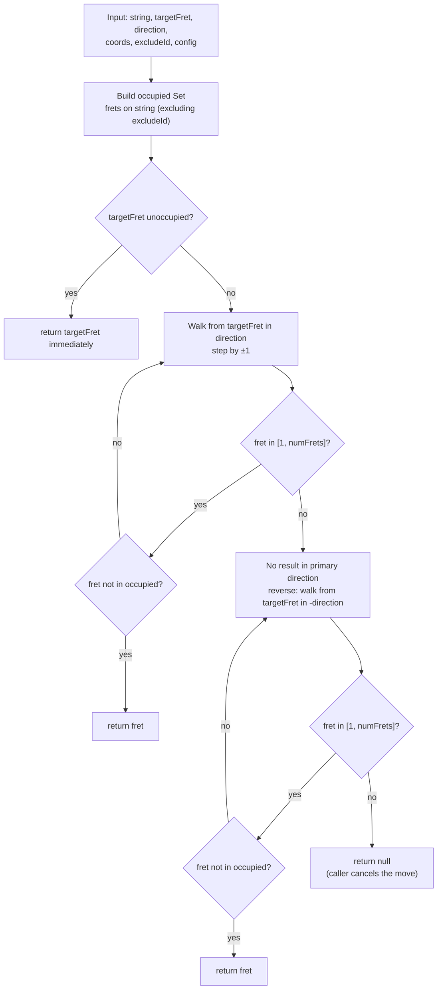

---

## Resize Trim (Coord Pruning on Config Change)

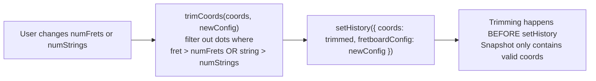

---

## Save Preset Dialog

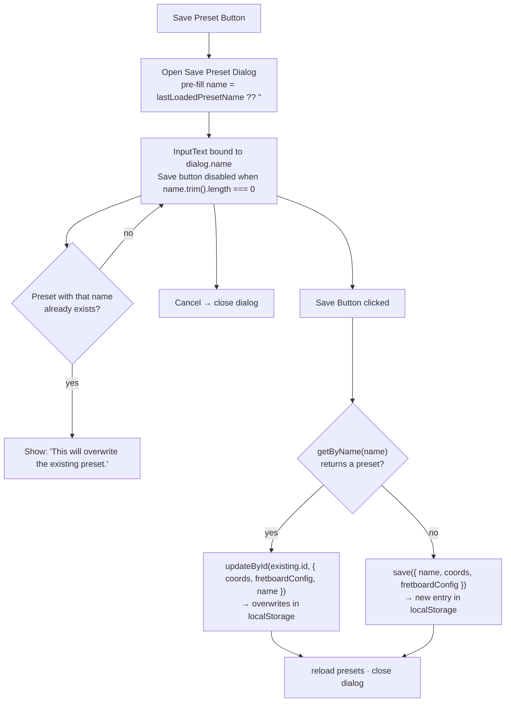

---

## Export Dialog

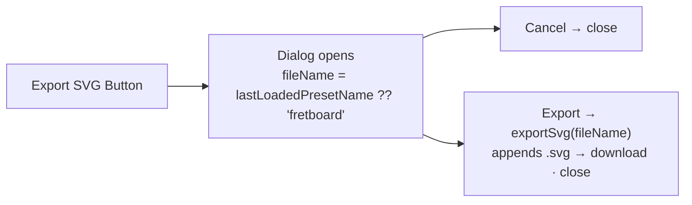

---

## SVG Export

No external dependencies — uses native `XMLSerializer`.

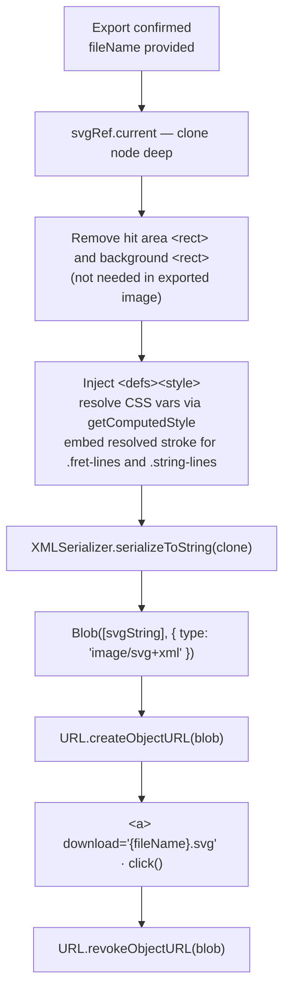

Dot `fill`, label text, and selection ring `stroke` are **inline SVG attributes** — they survive export without CSS resolution.

---

## SVG Layer Order

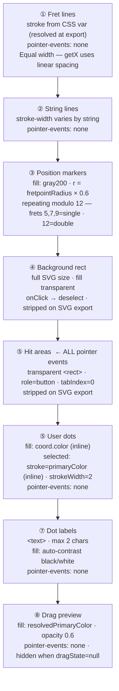

---

## Position Marker Geometry

Markers repeat every 12 frets. Only rendered when `fret ≤ numFrets`.

```
markerPosition(fret) = fret % 12 === 0 ? 12 : fret % 12

Single dot:  markerPosition in { 5, 7, 9 }
Double dot:  markerPosition === 12

Examples for a 24-fret neck:
  fret 5  → 5 % 12 = 5   → single
  fret 7  → 7 % 12 = 7   → single
  fret 9  → 9 % 12 = 9   → single
  fret 12 → 12 % 12 = 0  → mapped to 12 → double
  fret 17 → 17 % 12 = 5  → single
  fret 19 → 19 % 12 = 7  → single
  fret 21 → 21 % 12 = 9  → single
  fret 24 → 24 % 12 = 0  → mapped to 12 → double
```

Geometry (applied per marker fret):

```
Single dot
  cx  =  (getX(fret - 1, config) + getX(fret, config)) / 2
  cy  =  (getY(numStrings, config) + getY(1, config)) / 2    ← vertical center
  r   =  fretpointRadius × 0.6

Double dot (markerPosition = 12)
  cx  =  same
  cy1 =  center − (fretpointRadius × 1.5)
  cy2 =  center + (fretpointRadius × 1.5)
  r   =  fretpointRadius × 0.6
```

Fretboard visual (12 frets, 4 strings):

```
  NUT                                                                     BRIDGE
   |    |    |    |    |    |    |    |    |    |    |    |    |
───┼────┼────┼────┼────┼────┼────┼────┼────┼────┼────┼────┼────┼───  string 4
   |    |    |    |    |    |    |    |    |    |    |    |    |
───┼────┼────┼────┼────┼────┼────┼────┼────┼────┼────┼────┼────┼───  string 3
   |    |    |    |    | ·  |    | ·  |    | ·  |    | ·  |    |
   |    |    |    |    |    |    |    |    |    |    | ·  |    |     ← fret 12 = double
───┼────┼────┼────┼────┼────┼────┼────┼────┼────┼────┼────┼────┼───  string 2
   |    |    |    |    |    |    |    |    |    |    |    |    |
───┼────┼────┼────┼────┼────┼────┼────┼────┼────┼────┼────┼────┼───  string 1
   1    2    3    4    5    6    7    8    9   10   11   12
                       ^         ^         ^         ^^
                                           equal-width cells
```

---

## Hit Area Geometry

```
         getX(fret-1)        getX(fret)
              │                  │
              ├──────────────────┤  ← y = getY(string) − hitHeight / 2
              │                  │
getY(string) ─┤        ●         │  ← string line / dot center
              │                  │
              ├──────────────────┤  ← y = getY(string) + hitHeight / 2

  x       =  getX(fret - 1, config)
  y       =  getY(string, config) − hitHeight / 2
  width   =  getX(fret, config) − getX(fret - 1, config)   ← equal for all cells
  height  =  fretpointRadius × 3
  fill    =  "transparent"
  role    =  "button"
  tabIndex = 0
  aria-label = "String {s}, Fret {f} — {empty | occupied}"
  cursor  =  "pointer" (empty) | "grab" (occupied)
```

Total hit areas = `numStrings × numFrets`

---

## Snap Logic (`snapToCell`)

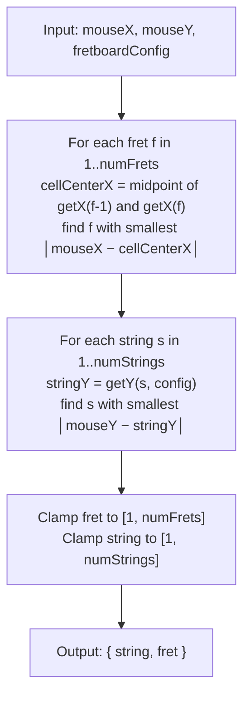

---

## Preset Data Model

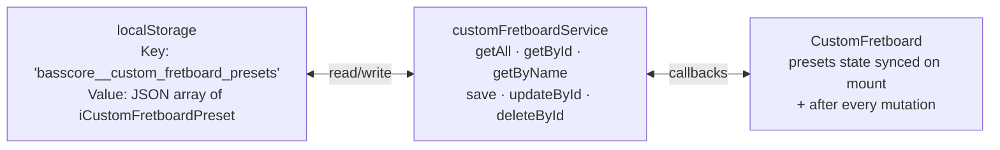

```
iCustomFretboardPreset {
  id             UUID → future DB primary key
  name           user display name
  createdAt      ISO 8601 → future DB created_at
  updatedAt      ISO 8601 → future DB updated_at
  coords         iCoords[] — id, color, label per dot
  fretboardConfig iFretboardConfig snapshot
}
```

---

## Undo / Redo Stack

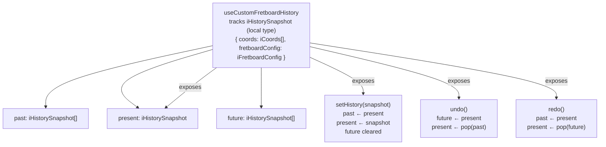

`iHistorySnapshot` is a local type in `useCustomFretboardHistory.ts` — not added to `types.ts`.

When `undo`/`redo` fires, `CustomFretboard` reads `present.fretboardConfig` and calls `setFretboardConfig` via `useEffect` to keep `ControlsContext` in sync.

---

## Mobile Behavior

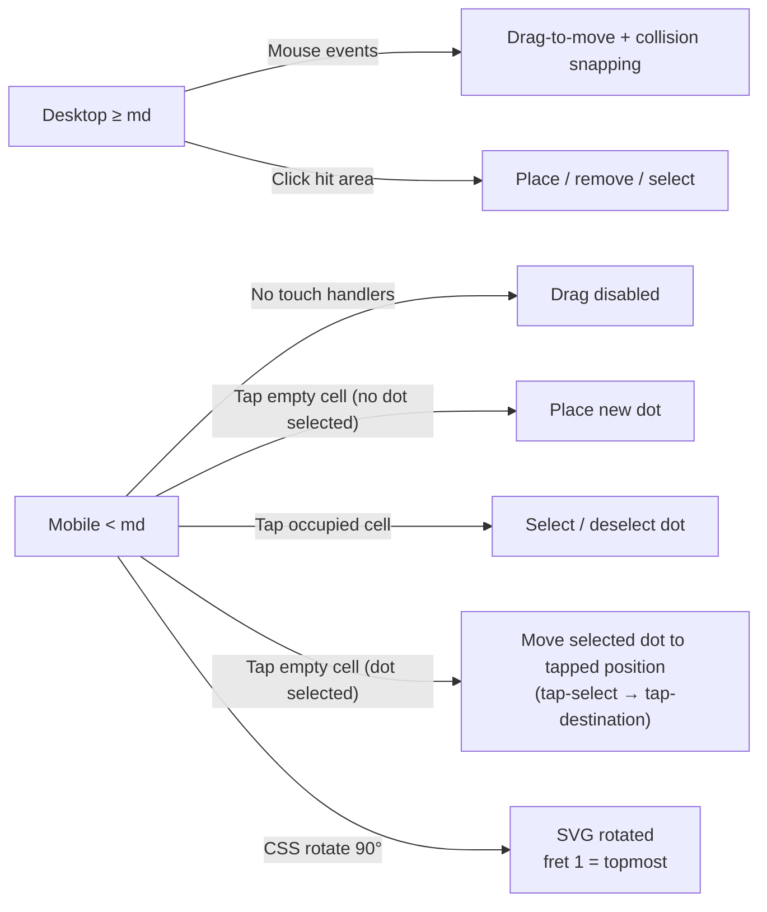

`customFretboard.scss` hides drag preview and resets cursor at `@media (max-width: md)`.
